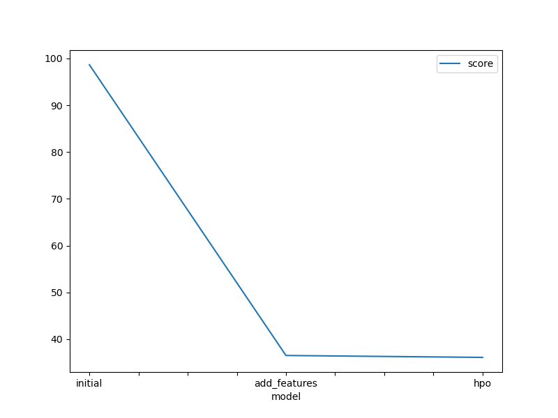
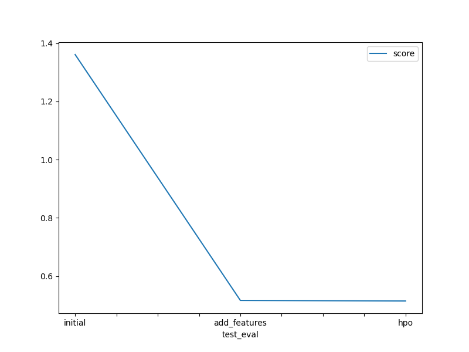

# Report: Predict Bike Sharing Demand with AutoGluon Solution
#### Ishan Mitra

## Initial Training
### What did you realize when you tried to submit your predictions? What changes were needed to the output of the predictor to submit your results?
The model had a very decent predictions for the initial time limit of 10 minutes.  
An increase in time limit would allow the predictor to train the other models as well.

### What was the top ranked model that performed?
The top model during initial training is WeightedEnsemble_L3 with R2 metric evaluation score of 0.9300.  
Kaggle score of this model is 1.36109.

## Exploratory data analysis and feature creation
### What did the exploratory analysis find and how did you add additional features?
Through EDA, a histogram plot of all the features were mapped to understand the range value of counts.  
To further understand the correlation between count and hours of the day, a custom bar plot was mapped.  
The plot shows that there is a signifant bike demand during the morning hours from 7AM to 12PM.  
The plot also shows a higher demand for bikes from 10PM till 12AM compared to lunch and evening hours.  
Through this, it seemed justifiable to extract the hour from the datetime column as a feature.

### How much better did your model preform after adding additional features and why do you think that is?
The top model is WeightedEnsemble_L2 which returned a R2 metric evaluation score of 0.9874.  
Kaggle score of this model is 0.51640.  
The model showed significant improvement in both metric evaluation as well as reduction of RMSE after Kaggle submission.

## Hyper parameter tuning
### How much better did your model preform after trying different hyper parameters?
The top model is WeightedEnsemble_L2 which returned a R2 metric evaluation score of 0.9901.  
Kaggle score of this model is 0.51451.  
The hyperparameter tuning gave very diminishing gains over the previous model and the R2 metric is very close to 1 which may suggest that the model is overfitting.

### If you were given more time with this dataset, where do you think you would spend more time?
Given additional time for this dataset, more time would be assigned to feature testing, finding correlations and prototyping model runs to obtain a more desireable model.

### Create a table with the models you ran, the hyperparameters modified, and the kaggle score.
|model|hpo1|hpo2|hpo3|score|
|--|--|--|--|--|
|initial|XGBoost|LightGBM|CatBoost|1.36109|
|add_features|booster:dart|metric:rmse|eval_metric:RMSE|0.51640|
|hpo|num_round:2|learning_rate:0.01|max_leaves:64|0.51451|

### Create a line plot showing the top model score for the three (or more) training runs during the project.

### Create a line plot showing the top kaggle score for the three (or more) prediction submissions during the project.

## Summary
A baseline structure is created with the initial training dataset which sets the metric score that needs to be improved.
Through EDA, a strong correlation was obtained between the count and the hours of the day, showing an interesting trend of bike demand during the morning and late evening.  
Hyperparamter tuning and optimisation yielded very minimal gains which strongly suggests that the best way to improve the model is through further feature testing.
